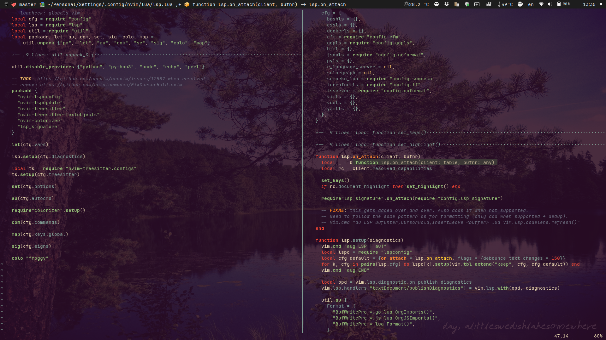

# Neovim config

Requires `nightly`.

Features:

- 100% ~~Lua~~ [Fennel](https://fennel-lang.org) based (well, technically, it's still Lua ;-))
  thanks to [Hotpot](https://github.com/rktjmp/hotpot.nvim);
- **syntax highlighting** (as well as **code folding**, **incremental selection**, **text objects** & more)
  powered by [nvim-treesitter](https://github.com/nvim-treesitter/nvim-treesitter);
- [builtin LSP](https://neovim.io/doc/user/lsp.html) setup for a dozen languages, of which I mostly use Go,
  Terraform, Lua, JavaScript and now Fennel :-);
- dual LSP setup, via [EFM](https://github.com/mattn/efm-langserver) to cover for "gaps", where needed,
  i.e.: I use `tsserver` for **JS**, but prefer `prettier` for formatting; I use `gopls` for **Go**, but I also
  want warnings from `golangci-lint`, etc.; I use `sumneko` for **Lua**, but also `efm` to run `lua-format` and
  `luacheck`;
- autoformat wherever possible; organize imports for **Go** and **JS**;
- builtin "fuzzy" searching (`set path=**` and just use `:find *whatever*` for filenames or `:Grep *whatever*`
  (set to `git grep`) for content);
- **git** integration: only a custom visual diff and for the rest, I just `:!git` away;
- convenient access to terminal (via `:Term` or `<C-n>`);
- easy access to all config files (`:Cfg <tab>`);
- minimal config that's been battle tested on the nightly branch since June 2020;
  no package manager, using builtin [packages](https://neovim.io/doc/user/repeat.html#packages) feature +
  git submodules for managing the plugins;
- minimal UI (no statusbar/linenumber; git branch, filename and function/method name are in the titlebar),
  using [my own colorscheme](https://github.com/alexaandru/froggy);
- no auto-completions for now, got used to [insert mode completions](https://neovim.io/doc/user/insert.html#ins-completion)
  and omnicomplete is set to `v:lua.vim.lsp.omnifunc` when available.

